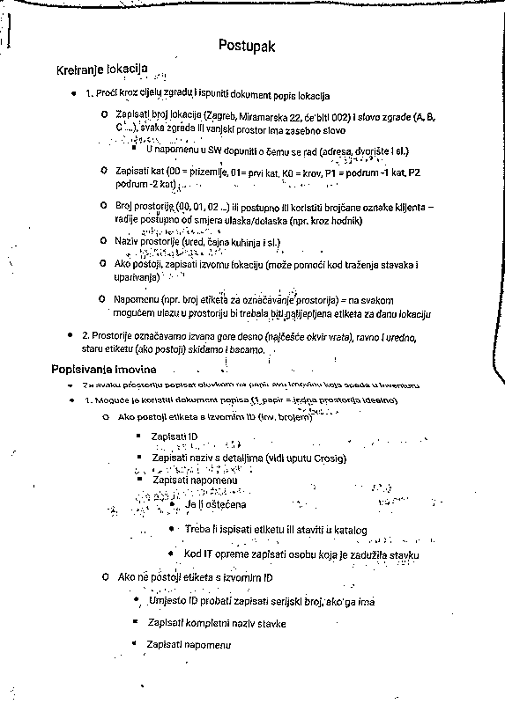

# DocumentScanner
A simple document scanner built using OpenCV and imutils<br>


## Installation
1. Clone the repository
```bash
git clone https://github.com/VMoskov/DocumentScanner.git
```
2. Install the required packages
```bash
pip install -r requirements.txt
```

## Usage
1. Run the script with the following command
```bash
python document_scanner.py --image images/<file_name>.jpg
```
or just
```bash
python document_scanner.py -i images/<file_name>.jpg
```
2. The scanned document will be displayed on the screen
3. Press `0` to close the window

## Example
Original image:<br>
<br>
Image with edges:<br>
<br>
Detected document:<br>
<br>
Scanned document:<br>


## More examples with real-life documents
1. Paper with text:<br>
   <br>
   <br>
    <br>
    

2. Colored payment slip:<br>
    <br>
    <br>
     <br>
     